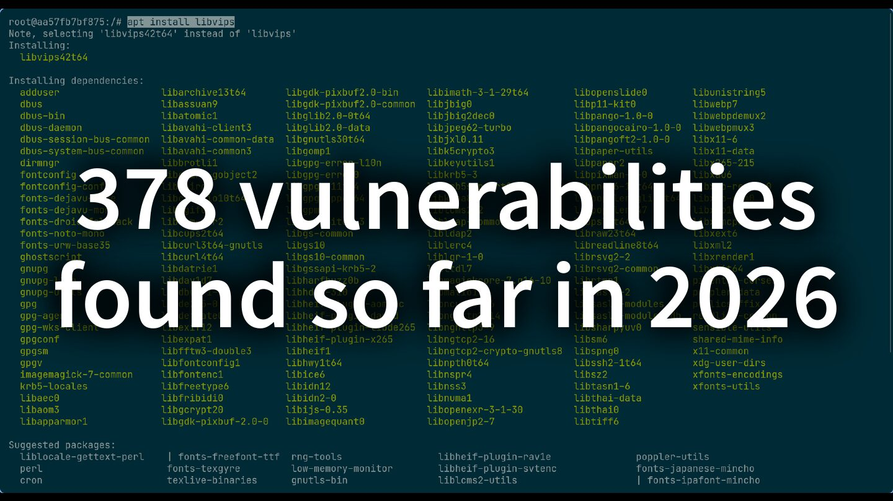
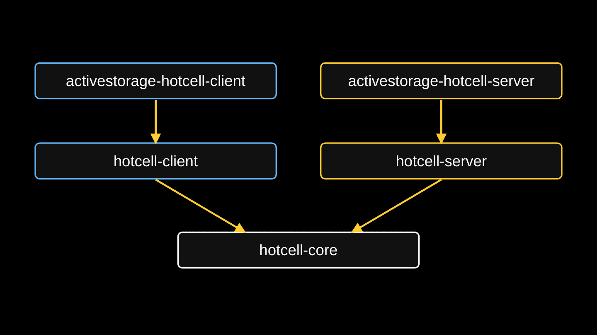
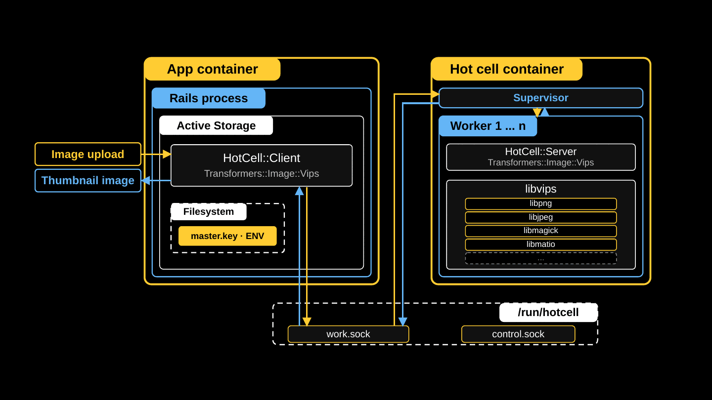
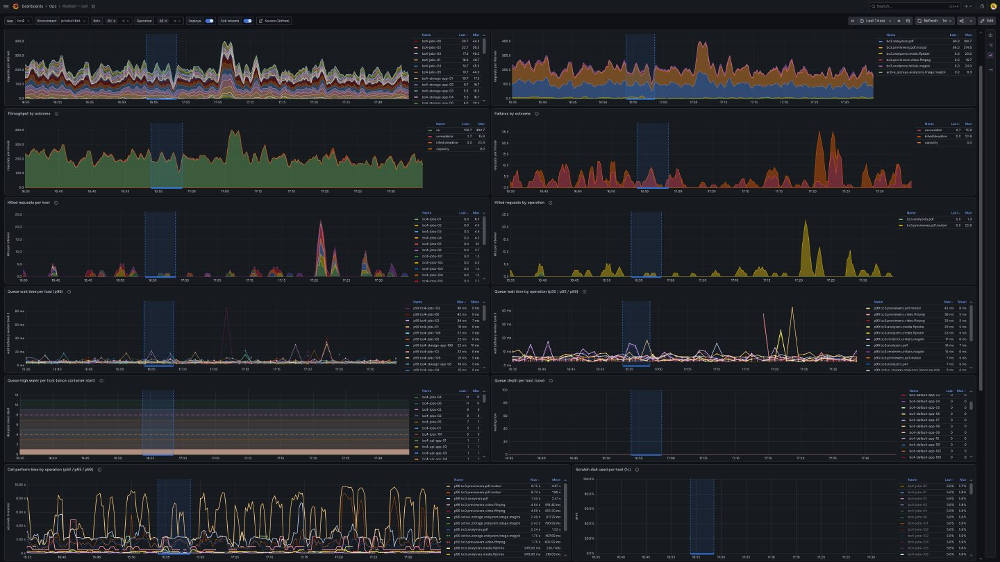

<!-- TODO: set the date above and below to the v1.0 release date -->

# Hot Cell v1.0: Securing Active Storage in the age of AI

2026-10-02
{: .text-sm .italic .opacity-75 }

Today we are releasing [Hot Cell](https://github.com/basecamp/hotcell) v1.0, a suite of gems that moves Active Storage's attachment processing out of your Rails application and into an unprivileged sidecar container with no network, no credentials, and nothing on its filesystem worth stealing. Adopting it is a configuration change, not a code change. It is already running in production at 37signals, in Basecamp, HEY, and Fizzy.

I introduced Hot Cell at Rails World 2026 in a talk titled "Hot Cell: Securing Active Storage in the age of AI." What follows is basically that talk, written down, plus a couple of things that have changed since then. (If you'd rather [watch the video](https://www.youtube.com/watch?v=swXl8M84YmM&list=PLdMRFKO1zSBE&index=28) or [flip through the slides](/prez/2026-09-23_rails-world-hotcell/slides.html), go for it.)

## Where we are


In the beginning, the earth cooled. Dinosaurs roamed the earth. Then humans started writing software, and a lot of that software was very trusting in nature: corner cases weren't explored, and the design assumed users were friendly and input could be trusted.

Now we find ourselves in a very chaotic moment where AI is very good at finding these bugs and security problems. I don't know what's coming, but at this moment I'm very worried, and I think you should be too. So first I'm going to scare you, and then I'm going to give you the tools to do something about it.


## Part 1: You are not worried enough (probably)

My summer started with [CVE-2026-66066](https://discuss.rubyonrails.org/t/cve-2026-66066-possible-arbitrary-file-read-and-remote-code-execution-in-active-storage-variant-processing/91432), nicknamed "KindaRails2Shell." I'm a member of the Rails security team, and I happened to catch this report and ended up working on it. We scored it 9.5 on CVSS, which is about as bad as it gets. Here's the description we published:

> In versions prior to 7.2.3.2, 8.0.5.1 and 8.1.3.1, Active Storage does not disable libvips operations marked unsafe for untrusted content, allowing a crafted upload to invoke such an operation. Consuming applications are affected when configured to use libvips and accept image uploads from untrusted users. An unauthenticated attacker may exploit this behavior to read arbitrary files accessible to the Rails process, including environment variables and application secrets. Exposure of credentials such as secret_key_base or external-service tokens may enable remote code execution or lateral movement.

I wrote this CVE description to be intentionally opaque. We didn't disclose any details about the attack, because we didn't want attackers to start exploiting live apps before anyone had a chance to upgrade. We were trying to buy you some time. Unfortunately, AI has gotten so good that multiple researchers were still able to derive this attack within hours of the announcement, quickly making the embargo meaningless.

You can watch the talk for a more in-depth explanation, but the root of the problem is that the image processing libraries are running in a container with access to your secrets and to your network.


And there was no single big vulnerability here that AI agents could find. The attack requires chaining together several low-severity vulnerabilities along with some Rails design decisions that helped enable the attack.

1. **Active Storage direct uploads were enabled by default**, so the route was open even in apps that didn't use them. Niklas Häusele fixed that in [rails/rails#58369](https://github.com/rails/rails/pull/58369).
2. **Direct uploads never examine the bytes.** The file goes from the browser to the blob store without passing through Rails, so Rails trusts the reported content type. Lying about the content type is the way in. Fixing this would cost performance.
3. **Signed variation keys do not include the blob ID**, which makes the attack easier to pull off. It's not a security problem on its own, and changing it would be a breaking change.
4. **Rails didn't call `Vips.block_untrusted`.** libvips added it in 8.13 as an opt-in, buried in a changelog. Calling it is the fix for this CVE.
5. **libvips was fooled by a spoofed MATLAB header.** This is the actual flaw. It's fixed in libvips 8.18.5, and no CVE was published.
6. **libmatio trusts every file it is handed**, as designed. The maintainers pointed back at libvips: you shouldn't be handing untrusted files to libmatio. Won't fix.
7. **Known gadgets turn `secret_key_base` into RCE.** The Rails security team knows about these, but closing them is a breaking change.

Agents are able to chain all seven together from very little information. They are getting very good at this! In the talk I showed a recording of the exploit script pulling every secret out of a development app in real time. Once you know how to execute the attack, it happens very fast.



It should also scare you that 378 vulnerabilities were published in libvips and its dependencies in the first nine months of 2026, and more are reported every day.


This chart is 37signals' HackerOne data: valid reports received each month. There has been a steady increase since models turned the corner back in November 2025.

So there's a whole category of problems here. I can fix this one CVE, but we'll have to go through all of this again when someone finds a zero-day in the _next_ image processing library. Hardening those libraries is not under our control, and it's not something we can fix within Rails.

When I think about addressing the bigger issues here, I think about risk:


The probability of another vulnerability in these libraries is very high, and it's not going down any time soon. That leaves impact. How do we shrink the blast radius, so that the next vulnerability does as little damage as possible?


## Part 2: Reducing the blast radius

The question I want to answer is: **How can we run Active Storage so that it doesn't matter if the libraries are vulnerable or if the input is maliciously crafted?**

You're probably thinking "sandbox!" and so was I. But I wanted some very specific attributes in this sandbox.


### Step 1: Define the requirements

This list became the prompt I gave my agent as we built the system together:

- **Implement existing Rails behavior.** A drop-in replacement for Active Storage's analyzers, transformers, and previewers. A configuration change, not a code change.
- **Least privilege.** No capabilities, no privilege escalation, no `setuid`, an unprivileged user.
- **Hard limits.** Wall-clock deadline, memory, file size, open files, and process count.
- **No access to the app filesystem.** No app code, no credentials. The filesystem is read-only and `noexec`.
- **No access to the app environment.** No secrets to exfiltrate.
- **No network interface.** No calling home, and no lateral movement.
- **Disposable.** A process per request, killed and reaped when it's done, so remote code execution has a short lifetime.
- **Familiar lifecycle.** Deployable with Kamal or Kubernetes.
- **Extensible behavior.** If you want a secure place to unzip files, you should be able to build that too.


### Step 2: An obscure, too-clever name


<!-- TODO: this frame is from an ORNL video. Confirm it's OK to republish, and credit or link the source. -->

This is a hot cell at Oak Ridge National Laboratory. It's a shielded chamber for handling radioactive material: a big lead box with a window that radiation can't pass through. The operator stays outside and does everything with manipulator arms, and nothing enters or leaves except by controlled transfer.

That's exactly what I want for Active Storage.


### Step 3: Jam it into Rails

Thankfully, Rails already has configuration for this. Analyzers extract metadata, like the number of pages in a PDF. The variant processor does transformations: rotating, cropping, resizing. Previewers generate thumbnails for files that aren't images, like PDFs and videos. Here are the defaults, trimmed to the ones we care about:

```ruby
# config/application.rb
config.active_storage.variant_processor = :vips
config.active_storage.analyzers = [ ActiveStorage::Analyzer::ImageAnalyzer::Vips,
                                    ActiveStorage::Analyzer::VideoAnalyzer ]
config.active_storage.previewers = [ ActiveStorage::Previewer::MuPDFPreviewer ]
```

And here's the target API, with no application code changes:

```ruby
# config/application.rb
config.active_storage.variant_processor = ActiveStorage::HotCell::Client::Transformers::Image::Vips
config.active_storage.analyzers = [ ActiveStorage::HotCell::Client::Analyzers::Image::Vips,
                                    ActiveStorage::HotCell::Client::Analyzers::Video::FFprobe ]
config.active_storage.previewers = [ ActiveStorage::HotCell::Client::Previewers::Pdf::Mutool ]
```

One caveat: passing a class as the `variant_processor` became possible with [rails/rails#58384](https://github.com/rails/rails/pull/58384), so the Active Storage gems need Rails 8.2.
<!-- TODO: update for the Rails 8.2 release status at the time of v1.0 -->



Hot Cell is a family of gems. `hotcell-core` holds the common bits: the wire protocol, descriptor passing, and the error codes. `hotcell-client` runs in your app and `hotcell-server` runs in the cell. The `activestorage-hotcell-client` and `activestorage-hotcell-server` gems subclass those to provide the drop-in replacements for Rails. Since the talk, a sixth gem has joined them: `yabeda-hotcell`, which I'll get to below.


### Step 4: Inputs and outputs

I've hand-waved over how the client and the server communicate, given that the cell has no network interface.

The answer is UNIX sockets. A UNIX socket is a file on disk that two processes on the same host can talk over, and nothing about it is routable on a network. A cell exposes two of them in a shared directory: one for work, and one for metadata and control.

And the magic bit is that `sendmsg()` can pass open file descriptors over a UNIX socket. The Hot Cell client in your app opens the upload and the output file, and hands those descriptors to the cell. The cell reads and writes through them but never sees a path, and has no access to the rest of your filesystem. Inputs are read-only and outputs are write-only, and the kernel enforces it. Passing descriptors also closes off the class of attacks that use symbolic links to traverse paths.


### Step 5: Doing the work

This part is a supervisor and workers, like Puma or Solid Queue.

The supervisor is pid 1 in the cell. It accepts connections, queues them, hands each to a worker, enforces the wall-clock deadline, kills the process group, and reaps. It never reads a request and never evaluates a byte of image data.

Each request is handled by a forked worker. A successful attack only compromises that worker, which gets reaped.



That's the finished system, and it's what is running in production at 37signals today. Now that I've scared you, I'm telling you that you should be running Hot Cell in your apps, and here's how.


## Part 3: Rolling it out

Add `activestorage-hotcell-client` to your app's `Gemfile`, and run the installer:

```
$ bin/rails hotcell:install
$ find hotcell
hotcell/Dockerfile
hotcell/Gemfile
hotcell/config.rb
hotcell/operations/
hotcell/operations/.keep
```

Everything about the cell lives in that `hotcell/` directory. The cell has its own `Gemfile`, which you should keep short, because every gem in it is inside the blast radius. `config.rb` is plain Ruby, not Rails, and sets the cell's limits. Each operation's own limits are clamped to these:

```ruby
# hotcell/Gemfile
source "https://rubygems.org"

gem "hotcell-server", "~> 1.0"
gem "activestorage-hotcell-server", "~> 1.0"
```

```ruby
# hotcell/config.rb
HotCell.limits concurrency: 4,
               queue_size: 8,
               queue_wait: 10,
               deadline: 120,
               memory: 1536 * 1024**2,
               file_size: 256 * 1024**2
```

The only thing the app and the cell share is a volume holding the two sockets. In the app's Kamal config, you join the cell's group and mount the volume:

```yaml
# config/deploy.yml -- the app
servers:
  web:
    options:
      group-add: 10001

volumes:
  - hotcell-sockets:/run/hotcell/active_storage

env:
  clear:
    HOTCELL_ROOT: /run/hotcell
    HOTCELL_GROUP: 10001
```

The cell is a Kamal accessory, because Kamal hard-codes the network for roles and `network: none` is the point:

```yaml
# config/deploy.yml -- the cell
accessories:
  active_storage:
    image: your.registry.com/your-image:latest
    roles: [ web, jobs ]
    network: none
    volumes:
      - hotcell-sockets:/run/hotcell/cell
    options:
      cpus: 2
      memory: 2g
      memory-swap: 2g
      pids-limit: 512
      read-only: true
      cap-drop: ALL
      security-opt: no-new-privileges:true
      user: 10001:10001
      tmpfs: /tmp:rw,nosuid,nodev,noexec,size=512m
    env:
      clear:
        HOTCELL_DIR: /run/hotcell/cell
```

The volume matches the app's. The resource limits cap CPU, memory (with swap pinned equal so the limit holds), and processes, so a fork bomb dies in the cell. And every one of `network: none`, `read-only`, `cap-drop`, and `no-new-privileges` is a security property. If you omit one, the protection is gone and the cell keeps serving requests exactly as before.

Then pick the Hot Cell twin of each Active Storage class you use:

| `ActiveStorage` | `ActiveStorage::HotCell::Client` |
| --- | --- |
| `Transformers::Vips` | `Transformers::Image::Vips` |
| `Transformers::ImageMagick` | `Transformers::Image::Magick` |
| `Analyzer::ImageAnalyzer::Vips` | `Analyzers::Image::Vips` |
| `Analyzer::ImageAnalyzer::ImageMagick` | `Analyzers::Image::Magick` |
| `Analyzer::VideoAnalyzer` | `Analyzers::Video::FFprobe` |
| `Analyzer::AudioAnalyzer` | `Analyzers::Audio::FFprobe` |
| `Previewer::MuPDFPreviewer` | `Previewers::Pdf::Mutool` |
| `Previewer::PopplerPDFPreviewer` | `Previewers::Pdf::Poppler` |
| `Previewer::VideoPreviewer` | `Previewers::Video::FFmpeg` |

Set the three Active Storage configs as above, and point Hot Cell at the sockets:

```ruby
# config/initializers/hotcell.rb
HotCell.root  = ENV["HOTCELL_ROOT"]
HotCell.group = ENV["HOTCELL_GROUP"]
```

On the cell side, require the operations that match. The cell isn't a Rails app, so there's no Zeitwerk; requiring a file is what serves its operation. This is also where you set per-operation limits:

```ruby
# hotcell/operations/active_storage.rb
require "active_storage/hot_cell/server/transformers/image/vips"
require "active_storage/hot_cell/server/analyzers/image/vips"
require "active_storage/hot_cell/server/analyzers/media/ffprobe"
require "active_storage/hot_cell/server/previewers/pdf/mutool"
require "active_storage/hot_cell/server/previewers/video/ffmpeg"

ActiveStorage::HotCell::Server::Transformers::Image::Vips
  .limits file_size: 256 * 1024**2

ActiveStorage::HotCell::Server::Previewers::Pdf::Mutool
  .limits deadline: 30
```

That's all it takes to port a Rails app that's using vanilla Active Storage!

1. Configure Active Storage.
2. Configure the cell's `Gemfile` and `config.rb`.
3. Extend the Kamal (or Kubernetes) config.

Once a file type is handled by the cell, consider removing its packages (libvips, ffmpeg, and so on) from your application image to reduce the attack surface.

The [Hot Cell repository](https://github.com/basecamp/hotcell) documents all of this, including every container flag and how to size the limits.
<!-- TODO: link the specific docs once basecamp/hotcell#94 lands -->


### Observability

We can't trust the workers, since any one of them may have been compromised. But we can trust the supervisor, and we can trust your Rails app, and between them they can give us fantastic visibility into image processing:

1. **Events in the app.** Every call publishes a `perform.hot_cell` Active Support notification with the operation, outcome, cause, bytes in and out, and timing. A dead cell shows up here too, as `unavailable`.
2. **Metrics from the supervisor.** The app asks the cell's control socket for metrics like queue depth, running workers, and kills by cause.
3. **Logs from the supervisor.** One JSON object per event on stdout, so you can see when a worker was killed and why.

In the talk, wiring those into your app was left as an exercise using our examples. In v1.0 they ship in the gems:

- `HotCell::LogSubscriber`, in `hotcell-client`, writes one line to the Rails log for every call.
- The `yabeda-hotcell` gem records [Yabeda](https://github.com/yabeda-rb/yabeda) metrics for every call, plus gauges scraped from each cell's control socket. Add the gem and call `Yabeda::HotCell.install!`.
- `HotCell::HealthController` and `HotCell::DiagnosticsController`, in `hotcell-client`, give you a public health check and an authenticated diagnostic endpoint that does a real round trip through the work socket.

The Hot Cell docs list the alerts we recommend.
<!-- TODO: link docs/observability.md once basecamp/hotcell#94 lands -->



This is the dashboard we use for Basecamp.


### The cost

In the talk, I said Hot Cell costs about 8ms per call in our environment. Since then, we've brought that down: **in Basecamp's production environment, the overhead is now about 3.4ms per call**.

That's a cheap price to know you won't be owned the next time a zero-day is found in an image library.


### Coloring outside the box

Hot Cell isn't only for Active Storage:

- You can run multiple cells per host, which gives you multiple queues with different depths, timeouts, and deadlines.
- An operation can take multiple input and output files.
- You can bring your own container. A conformance test tells you whether it's configured properly.
- Every operation's limits are configurable.

A custom operation is shaped like an Active Job. It lives in `hotcell/operations/`, has a routing name and its own default limits, and does its work in `perform`:

```ruby
# hotcell/operations/extract_text.rb
class ExtractTextOperation < HotCell::Operation
  operation "extract_text"
  limits deadline: 30.seconds, memory: 1280.megabytes

  def perform(inputs, outputs, format:, pages: [])
    source, = inputs
    destination, = outputs

    complicated_image_manipulation(source, destination, format:, pages:)
  end
end
```

In the app, a thin client class names the cell and the operation. Where a job has `perform_later`, a client has `perform_in_hotcell`, a blocking call that serializes the arguments, passes the descriptors, and returns the operation's result:

```ruby
class ExtractText < HotCell::Client
  hotcell "documents"
  operation "extract_text"
end

File.open(pdf_path, "rb") do |source|
  File.open(text_path, "wb") do |destination|
    @result = ExtractText.perform_in_hotcell(source, destination, format: "txt", pages: [1, 2])
  end
end
```

Opening the files yourself is the only hoop to jump through, and usually the class you write hides it.


### What production taught us

HEY and Fizzy are relatively modern apps that use vanilla Active Storage, and porting them was no sweat.

Basecamp was harder. Basecamp predates Active Storage (Active Storage was extracted from it), and a lot of its attachment code never moved over, so I had to write custom operations. Basecamp has 12 of them in its cell so far. Basecamp also uses attachments heavily; for some reason our customers love sending each other memes.

We had outages along the way, and I rolled the lessons back into the library:

- **The OpenMP thread pool.** ImageMagick, and the libraries libvips delegates to, size their OpenMP thread pools from the host's core count, not the container's `cpus` quota. On a 98-core production host that's 98 threads at 8MB of stack each, which blew through the worker's memory limit, and 285 workers died. The fix is to set `OMP_NUM_THREADS` and `OMP_THREAD_LIMIT` in the image, forwarded to every tool the cell runs.
- **The scratch disk filled.** ImageMagick wrote its pixel cache to `/tmp`, outside the per-request directory, and cleans it up only on a clean exit. Every killed worker left its cache behind, until the 4GB scratch filled on six hosts. While it was full, 3,393 files were marked permanently unreadable. The fixes were to point `TMPDIR` and `MAGICK_TMPDIR` at the request's directory ([hotcell#51](https://github.com/basecamp/hotcell/pull/51)), empty the scratch at boot ([hotcell#52](https://github.com/basecamp/hotcell/pull/52)), and size ImageMagick's limits to a worker's share of the scratch.
  <!-- TODO: link docs/imagemagick.md once basecamp/hotcell#94 lands -->

Allocate some time for tuning. Size `file_size` and the deadlines from what your real uploads take, then watch `killed` by cause. The Hot Cell docs cover how.
<!-- TODO: link docs/tuning.md once basecamp/hotcell#94 lands -->


### What's next

At Rails World I said Hot Cell wasn't 1.0 yet because we were waiting for Rails 8.2, and because I wanted to ship more of the observability features. The observability features are now in the gems.
<!-- TODO: say where Rails 8.2 stands at the v1.0 release -->

I'm still interested in [Linux Landlock](https://github.com/basecamp/hotcell/issues/13). Landlock lets a process ratchet down its own permissions so that it can never regain them, even if an attacker takes it over. That's a nice belt-and-suspenders addition, and if you know Landlock, I'd love to talk.


## Part 4: The moment we are in


Is this AI's fault? Well, it's easy to assign blame, and you'd be forgiven for doing so. AI chained several low-severity flaws into a critical-severity attack, and it made an effective embargo impossible.

But I want to suggest a more nuanced view. I'm seeing things trend in a good direction, and I want to be optimistic. I don't want Terminator, I want Star Trek. The alternative is that we all quit our jobs, turn off our computers, and become sheep farmers (I guess!?).

That HackerOne chart I showed you to scare you is the system working as designed. People are finding vulnerabilities and reporting them responsibly, which is exactly what we want. It's frustrating to deal with, but there are a finite number of vulnerabilities, and the number has to come back down at some point.

And when I said 378 vulnerabilities were found this year, what I should have said is that 378 vulnerabilities were **fixed**. Responsible maintainers are fixing the problems and shipping updates, and those libraries are trending in the right direction.

Here's what you can do to help us get through this faster:

- **Vulnerability reports should come with their own agent skills.** After the CVE, I published [rails/rails-forensics-CVE-2026-66066](https://github.com/rails/rails-forensics-CVE-2026-66066), extracted from my investigation of our own apps at 37signals. Point your agent at it and at your application, and ask whether you were vulnerable (probably) and whether you were exploited. It will go through your Active Storage records and tell you whether you need to rotate your secrets.
- **Attack your own work.** While building Hot Cell, I ran an adversarial review on almost every commit, and Jeremy helped me red-team it by setting agents loose to break in. They found real gaps. That doesn't make Hot Cell perfect, but it has fewer problems than it would have.
- **Improve or replace existing systems.** The only way through this period is for software to get better, or to be replaced. Hot Cell, baby!

Don't be too scared. Be proactive and constructive, and the future will be Star Trek, not Terminator.

Live long and prosper, and go try [Hot Cell](https://github.com/basecamp/hotcell).
