!SLIDE

# Nokogiri

## History, Present and Future

Presented at [GORUCO](http://goruco.com) 2013

<small>
by [Mike Dalessio](http://mike.daless.io) ([@flavorjones](https://twitter.com/flavorjones))
</small>

<small>
(a valid and well-formed presentation in 10 minutes)
</small>

 

<small>
permalink: [bit.ly/nokogiri-goruco-2013](http://bit.ly/nokogiri-goruco-2013)
</small>

!SLIDE

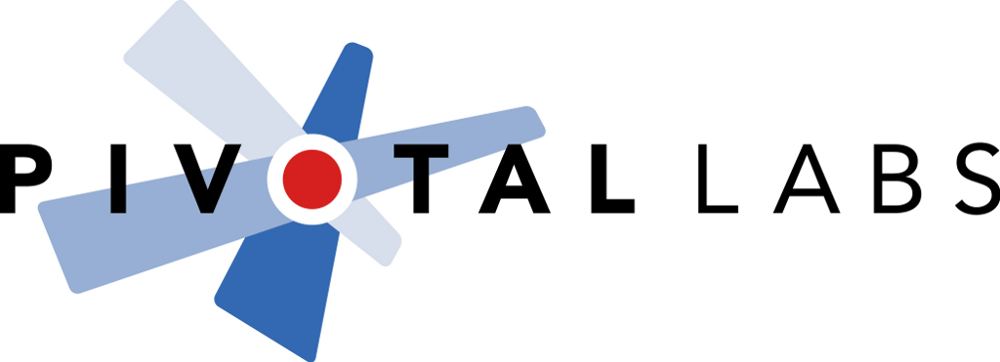

!SLIDE

!SLIDE

# Nokogiri

As of this morning, Nokogiri has been downloaded 11,755,224 times.

 

(For comparison, Rails is at around 24 million downloads.)

!SLIDE

Nokogiri == 

!SLIDE

Rails == 

!SLIDE

## How did that happen?

I shall tell you.

!SLIDE

But first ...

!SLIDE

# Etymology

What does it mean?

!SLIDE

 

It's a saw. You know, for cutting through trees. Of XML.

!SLIDE

# Origins

The year was 2008.

!SLIDE

## 2008

* [Rails 2.1](http://weblog.rubyonrails.org/2008/5/31/rails-2-1-time-zones-dirty-caching-gem-dependencies-caching-etc/) and [Ruby 1.8.7](http://www.ruby-lang.org/en/news/2008/05/31/ruby-1-8-7-has-been-released/) are released.
* 'Slumdog Millionaire' and 'Wall-E' in theaters.
* Oil hits $100/barrel for the first time.
* Stock markets crash. (Thanks, subprime lenders.)
* LHC goes online.
* Barack Obama is elected president.
* NY Gov. Eliot Spitzer resigns in disgrace.

!SLIDE

On September 9th, I had an email conversation with [Aaron Patterson](http://tenderlovemaking.com) ([@tenderlove](https://twitter.com/tenderlove)).

 

!SLIDE

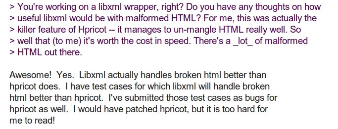

!SLIDE

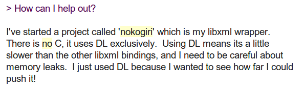

!SLIDE

## How did DL work out?

!SLIDE

## DL was slow. Really slow.

(But more on dynamic bindings later.)

!SLIDE

## Origins

We quickly moved to writing a C extension to bind to libxml2.

!SLIDE

## Origins

The toughest problem writing a C extensions?

### Debugging libxml2's memory management model.

!SLIDE

## Debugging Memory Issues and C extensions

Learn these tools!

- `valgrind`
- `perftools.rb` (Thanks to Aman Gupta!)

!SLIDE

## API Design

We boldly stole the best XML API we could find ...

!SLIDE

## API Design by Theft

Hpricot's API.

 

!SLIDE

First official release on November 17, 2008.

!SLIDE

## Meaningless Statistic

By January 2009, we had:

- 1,510 lines of Ruby code
- 1,760 lines of C code

!SLIDE

## Community acceptance

!SLIDE

Here are some BS performance stats from the time:

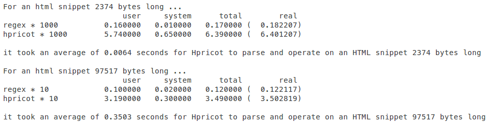

!SLIDE

People in the past argued a lot about XML library benchmarks.

- [Ruby Inside](https://webcache.googleusercontent.com/search?q=cache:http://www.rubyinside.com/ruby-xml-performance-benchmarks-1641.html)
- [Engine Yard](https://blog.engineyard.com/2009/xml-parsing-in-ruby)
- [This guy](http://www.patricktulskie.com/2009/03/libxml-ruby-vs-nokogiri-vs-hpricot/)

!SLIDE

Then, in August 2009, this:

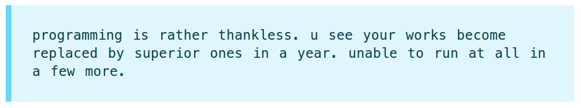

!SLIDE

!SLIDE

Sigh.

!SLIDE

# The Dawn of JRuby

!SLIDE

JRuby didn't fully support C extensions.

This was a problem for JRubyists who wanted to use Nokogiri.

!SLIDE

# I had a dream.

!SLIDE

One codebase that ran on MRI, Rubinius and JRuby.

!SLIDE

# My FFI Phase

!SLIDE

# What's FFI?

Foreign Function Interface

Ruby calling native C code directly.

!SLIDE

# I had a dream.

One codebase that bound to libxml2 on any platform.

!SLIDE

# Ruby FFI

A cross-platform Ruby API for accessing native C code.

!SLIDE

# Ruby FFI

Shout out to Wayne Meissner (@wmeissner).

FFI is basically magic.

!SLIDE

## My FFI Phase

I spent most of January -- May 2009 rewriting all the C code in Ruby.

!SLIDE

## My FFI Phase

It was painful.

!SLIDE

## Meaningful Statistic

It took **3,049** lines of Ruby code

to reproduce **4,150** lines of C code.

!SLIDE

# PAIN: Writing C in Ruby

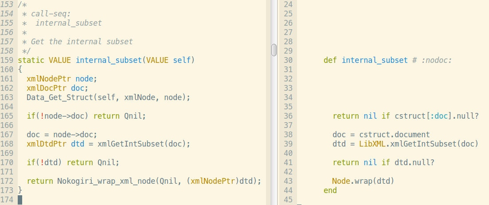

!SLIDE

## FFI port

Good: **It worked!**

 

(Golf clap.)

!SLIDE

## FFI port

Bad: **"Segfault-driven development"**

 

Handicapped by lack of compile-time checking.

!SLIDE

## FFI port

Bad: **Portable string handling is hard.**

 

JVM GC edge cases.

!SLIDE

## FFI port

Bad: **FFI code not any clearer than C**

 

Requires you think in C and translate to Ruby.

!SLIDE

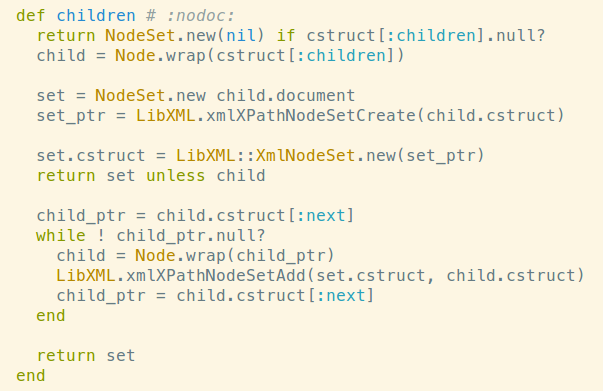

 

DO NOT WANT.

!SLIDE

## FFI port

**Really** Bad: Huge performance penalty.

!SLIDE

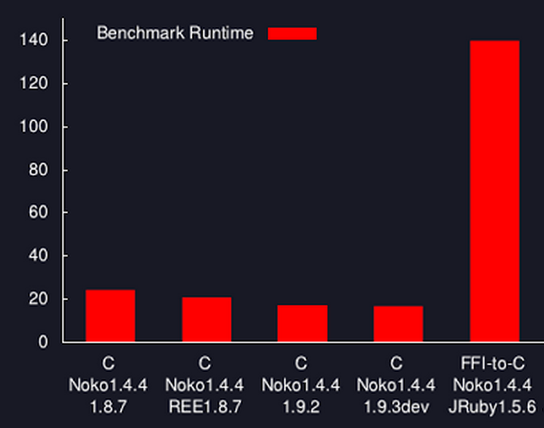

!SLIDE

## FFI port

And worst of all ...

!SLIDE

Let me tell you a story about RubyConf 2009.

!SLIDE

# All these choices suck.

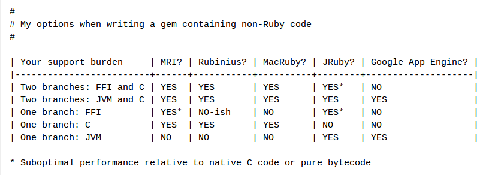

!SLIDE

# Outcome

Killed the FFI port.

Unpublished blog post.

 

:(

!SLIDE

# FFI Lessons

* If you care about performance, you need to write native extensions
* If you care about multi-platform, you need to support at least two codebases
* If you don't care about either, then FFI is for you!

!SLIDE

(Pause for a sip of beverage.)

!SLIDE

"Portability is for people who cannot write new programs."

-- *Linux Torvalds*

!SLIDE

## Enter Sergio Arbeo

!SLIDE

### Sergio Arbeo (@serabe)

College student.

Spiked on a pure-Java port over the summer.

!SLIDE

It (mostly) worked.

!SLIDE

!SLIDE

## Meaningless Statistic

    $ sloccount ext lib
    
    Totals grouped by language
    (dominant language first):

    java:          9206 (50.72%)
    ansic:         4758 (26.22%)
    ruby:          3932 (21.67%)
    yacc:           253 (1.39%)

!SLIDE

March 2012

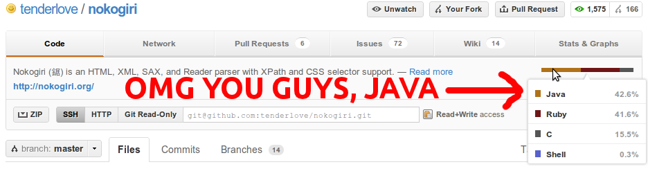

!SLIDE

## Meaningful Statistic

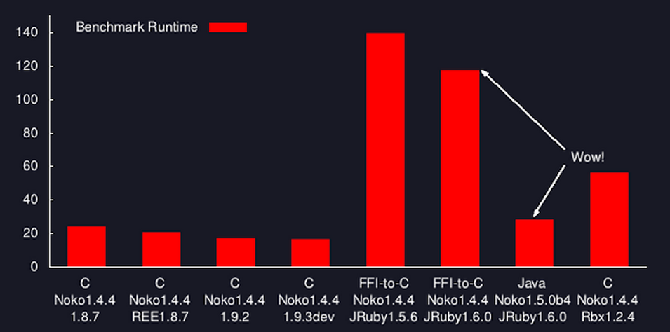

!SLIDE

## Ruby Bounty contributors

* Aaron Patterson (@tenderlove)
* Mike Dalessio (@flavorjones)
* Darrin Eden (@dje)
* Charles Nutter (@headius)
* Tony Arcieri (@tarcieri)
* Sergio Arbeo (@serabe)
* Roger Pack (@rdp)

!SLIDE

# Ruby Bounty winners

* Pat Mahoney (@pmahoney)
* Yoko Harada (@yokolet)
* Charles Nutter (@headius)
* Sergio Arbeo (@serabe)

!SLIDE

(Pause for a sip of beverage.)

!SLIDE

# The Present

!SLIDE

# Installation

!SLIDE

## Installation Problems and Solutions

!SLIDE

## Installation Problems and Solutions

- Windows
- JRuby
- everybody else

!SLIDE

## Installation on Windows

### It's complicated.

!SLIDE

Instant poll: Any Ruby Windows developers out there?

!SLIDE

Nobody has a build toolchain.

Nobody has libxml2 installed on their system.

!SLIDE

## Solution

Cross-compile and package the DLLs with the gem:

- libxml2
- libxslt
- libiconv
- zlib

!SLIDE

"Fat Binary" gems

    $ ls -l gems
    total 21652
    -rw-r--r-- 1 miked 9870336 Mar 11 17:31 nokogiri-1.5.7-x86-mingw32.gem
    -rw-r--r-- 1 miked 9870336 Mar 11 17:31 nokogiri-1.5.7-x86-mswin32-60.gem
    -rw-r--r-- 1 miked  221184 Mar 11 17:31 nokogiri-1.5.7.gem

!SLIDE

**Fat** because we have to compile against multiple rubies:

- Ruby 1.8.7
- Ruby 1.9.3
- Ruby 2.0 (as of nokogiri 1.5.7)

!SLIDE

## Windows

[Luis Lavena](https://github.com/luislavena) ([@luislavena](https://twitter.com/luislavena)) supports the Windows build toolchain basically single-handedly.

* `rake-compiler`
* `mini_portile`
* infinite patience

He rules!

!SLIDE

## Installation on JRuby

Nokogiri's JRuby port uses specific libraries:

- `isorelax`
- `jing`
- `nekodtd` and `nekohtml`
- `xerces`

These may not be installed on the target system.

!SLIDE

## Solution

Build and package `jar` files!

    $ ls lib/*jar
    lib/isorelax.jar
    lib/jing.jar
    lib/nekodtd.jar
    lib/nekohtml.jar
    lib/xercesImpl.jar
    

!SLIDE

The JRuby gem is also a "Fat Binary"

    $ ls -l gems
    total 21652
    -rw-r--r-- 1 miked 2204160 Mar 11 17:31 nokogiri-1.5.7-java.gem
    -rw-r--r-- 1 miked 9870336 Mar 11 17:31 nokogiri-1.5.7-x86-mingw32.gem
    -rw-r--r-- 1 miked 9870336 Mar 11 17:31 nokogiri-1.5.7-x86-mswin32-60.gem
    -rw-r--r-- 1 miked  221184 Mar 11 17:31 nokogiri-1.5.7.gem

!SLIDE

## Installation on MRI(-ish)

Like any ordinary C extension, we compile on installation.

!SLIDE

## Installation on MRI(-ish)

Unlike most C extensions, we have unwieldy external dependencies:

- libxml2
- libxslt

This is kind of lame.

!SLIDE

## External system dependencies

This is lame because

* everyone has different libxml2 versions installed
* ... in different places
* ... with different (possibly buggy) behavior

!SLIDE

## PAIN FOR YOU

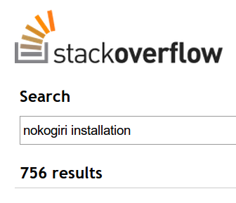

!SLIDE

## PAIN FOR ME

    int is_2_6_16(void)
    {
      return (strcmp(xmlParserVersion, "20616") <= 0) ? 1 : 0 ;
    }
    
    if (   reparentee->type == XML_TEXT_NODE
        && pivot->type      == XML_TEXT_NODE
        && is_2_6_16(
       ) {
      /* work around a string-handling bug in libxml 2.6.16.
         we'd rather leak than segfault. */
      pivot->content = xmlStrdup(pivot->content);
    }

!SLIDE

Have I told you about libxml 2.9.0 yet?

!SLIDE

"Wait."

!SLIDE

"Didn't you **just say** there's a toolchain for compiling autoconf
projects and binding to them at gem installation time?"

!SLIDE

Dude/Dudette!

!SLIDE

You've been paying attention!

!SLIDE

Thank you!

!SLIDE

# I'm Happy to Announce

(drumroll)

!SLIDE

## Nokogiri 1.6.0

Packages libxml2 and libxslt inside the gem.

!SLIDE

## Nokogiri 1.6.0

Installation will Just Work™.

You can still use your system libraries if you really want to.

!SLIDE

## Nokogiri 1.6.0

(Pending me running "gem push" in a few minutes.)

!SLIDE

## Naming Things is Easy!

I hereby invent the "Fat Source" gem.

 

!SLIDE

# The Future

!SLIDE

# The Future

Nokogiri 2.0 roadmap up at [github.com/sparklemotion/nokogiri](https://github.com/sparklemotion/nokogiri/blob/master/ROADMAP.md)

!SLIDE

## Highlights

- better serialization / pretty-printing
- faster SAX parsing (see the [fairy-wing throwdown](http://blog.flavorjon.es/2011/05/fairy-wing-wrapup-nokogiri-performance.html))
- better `Node` attributes API
- CSS query parsing (pseudo-selectors and JQuery compat)
- `Fragment` boogs
- better custom XPath handler API
- general encodings improvement
- `Reader`

!SLIDE

Let's talk afterwards. (Preferably, on the boat.)

